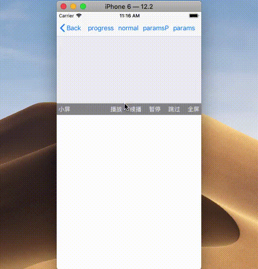
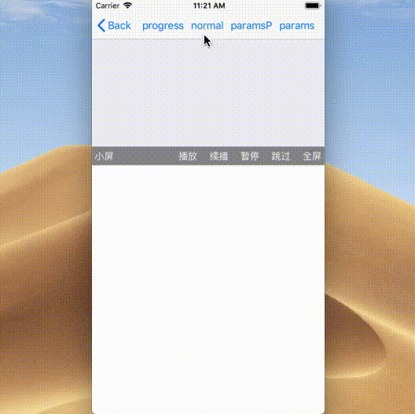

# JXVideoAds

[](https://travis-ci.org/bboyXFX/JXVideoAds)
[](https://cocoapods.org/pods/JXVideoAds)
[](https://cocoapods.org/pods/JXVideoAds)
[](https://cocoapods.org/pods/JXVideoAds)


#  GoogleAds-IMA-iOS-SDK 二次封装框架

---

##### 开发

1.    开发环境: Xcode 7
2.    运行条件: iOS(9.0+)
3.    管理平台: admanger帐号。 [https://admanager.google.com](https://admanager.google.com)
4.    官网文档地址:
[https://developers.google.com/interactive-media-ads/docs/sdks/ios/](https://developers.google.com/interactive-media-ads/docs/sdks/ios/)

&nbsp;

##### 注意: 

* 管理平台,官网文档都需要vpn才能浏览. 
* GoogleAds-IMA-iOS-SDK只提供了视频广告功能, 如果要实现横幅广告/插页式广告/原生广告/激励广告可以使用Google-Mobile-Ads-SDK, 后边的文章会介绍
* 开源框架：[github地址](https://github.com/Code-TanJX/googleads-ima-JXAVideoAds)
* 谷歌视频广告SDK介绍： [iOS视频广告(一) GoogleAds-IMA-iOS-SDK](https://blog.csdn.net/TanJiaXiang/article/details/94432972)

&nbsp;

（如果使用有什么问题，可以给我留言，欢迎一起学习，欢迎github-star, 点赞）

---

#### JXVideoAds介绍

&nbsp;

JXVideoAds是一个对谷歌视频广告SDK进行二次封装的框架, JXVideoAds主要提供了两个类控制广告的生命周期，任选一个使用即可:

###### （1）、 JXAVideoOperator - 基于NSObjct， 用于加载广告，类似于manager。

* 必须传入一个(UIView)container - 作为广告播放的容器视图。
* 必须传入(StateBlock)state - 广告加载和调用状态的回调。
* 必须传入(NSString)tagUrl - 广告Url。
* 可选：(ProgressBlock)progress - 加载进度回调。
* 可选：(AVPlayer)player - 播放器， JXVideoOperator可以根据传入的player返回给你广告播放进度。
* 可选：userContext：- 广告加载器标识。
* 可选：(ParamsBlock)params - 自定义参数构建Block。

&nbsp;

###### （2）、JXAVideoView - 基于UIView，作为广告播放的容器视图，也是广告的管理者。（推荐使用这个类，使用起来更简易，内部自己封装好了AVPlayer，无需传入）

* 必须传入(StateBlock)state - 广告加载和调用状态的回调。
* 必须传入(NSString)tagUrl - 广告Url。
* 可选：(ProgressBlock)progress - 加载进度回调。
* 可选：userContext：- 广告加载器标识。
* 可选：(ParamsBlock)params - 自定义参数构建Block。

&nbsp;

###### （另外JXAVideoParamsBuilder - 一个参数构建者，内部封装了一些常用的个性化参数，点语法依次自定义参数，开发者可以挑选使用。）

---

### Installation  [安装]
安装，只需将以下面代码添加到您的Podfile:

```ruby

platform :ios, '9.0'

target 'TargetName' do
pod 'JXVideoAds'
end

```

---

### Frame set [框架集合]
* API    外部应该访问的接口
* Common    SDK内部公共类
* GoogleIma  谷歌广告API

---

### The UI effect:

&nbsp;

* Breakpoint Play


&nbsp;

* Fullscreen


---

## SDK例子：

&nbsp;

####  [JXAVideoView 使用] :

&nbsp;


### Example 1

&nbsp;

```objc

// import
#import "JXAVideoView.h"

// 加载广告

- (IBAction)params:(id)sender {
    [self.containerView params:^JXAVideoParamsBuilder *(JXAVideoParamsBuilder *paramsBuilder) {
        return  paramsBuilder
        .autoPlayAdBreaks(YES)
        .adTagUrl(tag);
        } state:^(JXAVideoAdsState state, JXAVideoAds *video) {
        switch (state) {

            case JXAVideoAdsState_Loaded:
            NSLog(@"已经加载完毕 - JXAVideoAdsState_Loaded");
            //                [video play];
            break;

            case JXAVideoAdsState_Started:
            NSLog(@"已经开始播放广告 - JXAVideoAdsState_Started");
            break;
            case JXAVideoAdsState_Error:
            NSLog(@"加载错误 - JXAVideoAdsState_Error");
            break;
            case JXAVideoAdsState_Pause:
            NSLog(@"广告暂停 - JXAVideoAdsState_Pause");
            break;
            case JXAVideoAdsState_Ended:
            NSLog(@"广告播放结束 - JXAVideoAdsState_Ended");
            break;
            case JXAVideoAdsState_Skipped:
            NSLog(@"广告已经跳过 - JXAVideoAdsState_Skipped");
            break;

        default:
        break;
        }
    }];
}

// 不使用时，最好销毁。
- (void)viewDidDisappear:(BOOL)animated {
    [super viewDidDisappear:animated];
    [self.containerView remove];
}

```

---

### Example 2

&nbsp;

```objc

// import
#import "JXAVideoView.h"

- (IBAction)paramsP:(id)sender {

    [self.containerView params:^JXAVideoParamsBuilder *(JXAVideoParamsBuilder *paramsBuilder) {
        return  paramsBuilder
        .autoPlayAdBreaks(YES)
        .language(@"en")
        .enableBackgroundPlayback(YES)
        .volume(@1)
        .adTagUrl(tagOne)
        .userContext(nil)
        .player(nil)
        .mimeTypes(@[ @"video/mp4", @"application/x-mpegURL"])
        .bitrate(1024)
        .webOpenerPresentingController([JXViewController new])
        .webOpenerDelegate(self);
    } state:^(JXAVideoAdsState state, JXAVideoAds *video) {
        switch (state) {

        case JXAVideoAdsState_Loaded:
        NSLog(@"已经加载完毕 - JXAVideoAdsState_Loaded");
        [video play];
        break;

        case JXAVideoAdsState_Started:
        NSLog(@"已经开始播放广告 - JXAVideoAdsState_Started");
        break;
        case JXAVideoAdsState_Error:
        NSLog(@"加载错误 - JXAVideoAdsState_Error");
        break;
        case JXAVideoAdsState_Pause:
        NSLog(@"广告暂停 - JXAVideoAdsState_Pause");
        break;
        case JXAVideoAdsState_Ended:
        NSLog(@"广告播放结束 - JXAVideoAdsState_Ended");
        break;
        case JXAVideoAdsState_Skipped:
        NSLog(@"广告已经跳过 - JXAVideoAdsState_Skipped");
        break;

        default:
        break;
        }
    } progress:^(CGFloat current, CGFloat duration) {
        NSLog(@"currentTime -- %f \n duration -- %f", current, duration);
    }];
}

// 不使用时，最好销毁。
- (void)viewDidDisappear:(BOOL)animated {
    [super viewDidDisappear:animated];
    [self.containerView remove];
}


```
---

### Example 3 and so on ...

&nbsp;

---

## [XAVideoOperator 使用] :

&nbsp;

### Example 1 

```

#import "JXAVideoOperator.h"

- (IBAction)mNormal:(id)sender {

    self.operator = [[JXAVideoOperator alloc]
        initWithTagUrl:tagOne
        containerView:self.containerView
        userContext:nil
        state:^(JXAVideoAdsState state,
        JXAVideoAds *video) {
            switch (state) {

            case JXAVideoAdsState_Loaded:
            NSLog(@"广告加载完毕 - JXAVideoAdsState_Loaded");
            [video play];
            break;

            case JXAVideoAdsState_Started:
            NSLog(@"已经开始播放广告 - JXAVideoAdsState_Started");
            break;
            case JXAVideoAdsState_Error:    
            NSLog(@"加载错误 - JXAVideoAdsState_Error");
            break;
            case JXAVideoAdsState_Pause:
            NSLog(@"广告暂停 - JXAVideoAdsState_Pause");
            break;
            case JXAVideoAdsState_Ended:
            NSLog(@"广告播放结束 - JXAVideoAdsState_Ended");
            break;
            case JXAVideoAdsState_Skipped:
            NSLog(@"广告已经跳过 - JXAVideoAdsState_Skipped");
            break;

            default:
            break;
            }
    }];
}
...

```

```

- (void)viewDidDisappear:(BOOL)animated {
    [super viewDidDisappear:animated];
    [self.operator remove];
}

```

### Example 2 and so on ...

```

#import "JXAVideoOperator.h"
...

```

### [Demo地址](https://github.com/Code-TanJX/googleads-ima-JXAVideoAds)


## Author

Coder_TanJX, code_tanjx@163.com

## License

JXVideoAds is available under the MIT license. See the LICENSE file for more info.
